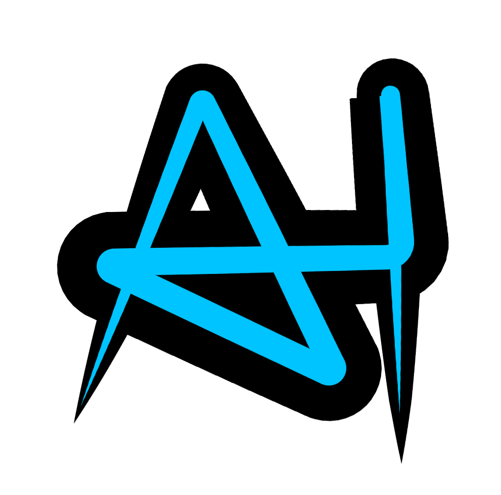

# AI Helper Pro

  

  <strong>AI 코딩 도구 통합 관리 데스크톱 애플리케이션</strong>

  <a href="#다운로드">다운로드</a> •
  <a href="#기능">기능</a> •
  <a href="#시스템-요구사항">시스템 요구사항</a> •
  <a href="#라이선스">라이선스</a>

---

## 다운로드

### Windows

| 버전 | 다운로드 | 릴리즈 날짜 |
|------|----------|-------------|
| **v0.1.4** (최신) | [AI Helper Pro-Windows-0.1.4-Setup.exe](https://github.com/nimto/AI_Helper_pro/releases/download/v0.1.4/AI.Helper.Pro-Windows-0.1.4-Setup.exe) | 2026-01-03 |

> **참고**: macOS 및 Linux 버전은 준비 중입니다.

---

## 기능

### 🤖 AI 도구 통합
- **Claude Code** - Anthropic Claude 기반 코딩 어시스턴트
- **Gemini CLI** - Google Gemini AI 터미널 도구
- **Codex** - OpenAI Codex 기반 코드 생성

### 📊 대시보드
- AI 사용 통계 한눈에 보기
- 커뮤니티 활동 현황
- 소셜 (팔로워/팔로잉) 정보
- 최근 활동 타임라인

### 📚 자료실 (Library)
- 프로젝트 파일 통합 관리
- 이미지 미리보기 및 최적화
- 다양한 파일 형식 뷰어 (마크다운, 코드, JSON 등)
- 폴더 트리 탐색 및 검색

### 🌍 다국어 지원
- 한국어 (ko)
- English (en)
- 日本語 (ja)
- 简体中文 (zh-CN)
- 繁體中文 (zh-TW)
- Filipino (tl)

### 🎨 UI/UX
- 다크 모드 기본 지원
- 반응형 레이아웃
- 커스터마이징 가능한 설정

---

## 시스템 요구사항

### Windows
- **OS**: Windows 10 이상 (64-bit)
- **RAM**: 4GB 이상 권장
- **디스크**: 500MB 이상 여유 공간

---

## 설치 방법

1. 위 다운로드 링크에서 최신 버전 설치 파일 다운로드
2. 다운로드한 `AI Helper Pro-Windows-0.1.4-Setup.exe` 실행
3. 설치 마법사의 안내에 따라 설치 완료
4. 시작 메뉴 또는 바탕화면의 "AI Helper Pro" 아이콘으로 실행

---

## 라이선스

이 소프트웨어는 개인 및 교육 목적으로 무료 사용 가능합니다.
상업적 사용에 대해서는 별도 문의해 주세요.

---

## 문의

- **이슈 리포트**: [GitHub Issues](https://github.com/nimto/AI_Helper_pro/issues)
- **웹사이트**: [https://al-helper.com](https://al-helper.com)

---

  Made with ❤️ by nimto

